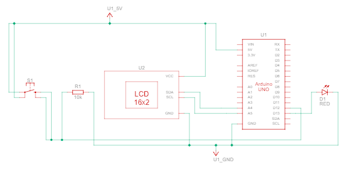

# Display directory

This directory contains the files that are using the 16x2 lcd display. The display is interfaced with the Arduino using the I2C module or directly using the digital pins.

## Components
- Arduino Uno
- LED (optional)
- Usb type A to B cable for interfacing computer to Arduino
- 10k ohm resistor
- 16x2 I2C LCD display

## How to use
1. Clone the repository
2. Open the `display-die.ino` file in Arduino IDE
3. Connect the Arduino to the computer
4. Upload the code to the Arduino
5. Connect the push button to the Arduino as shown in the circuit diagram
6. Press the push button to turn the LED on and off

## Diagrams
- Circuit diagram

## Additional code
Refer the code in `display-die` folder to see how to use the push button to and the respectable number will be displayed on the screen.

- Reference image

## Link to the tinkercad demo
[Click here to view the demo](https://www.tinkercad.com/things/d8LVjEjIsCN-push-button-dice)