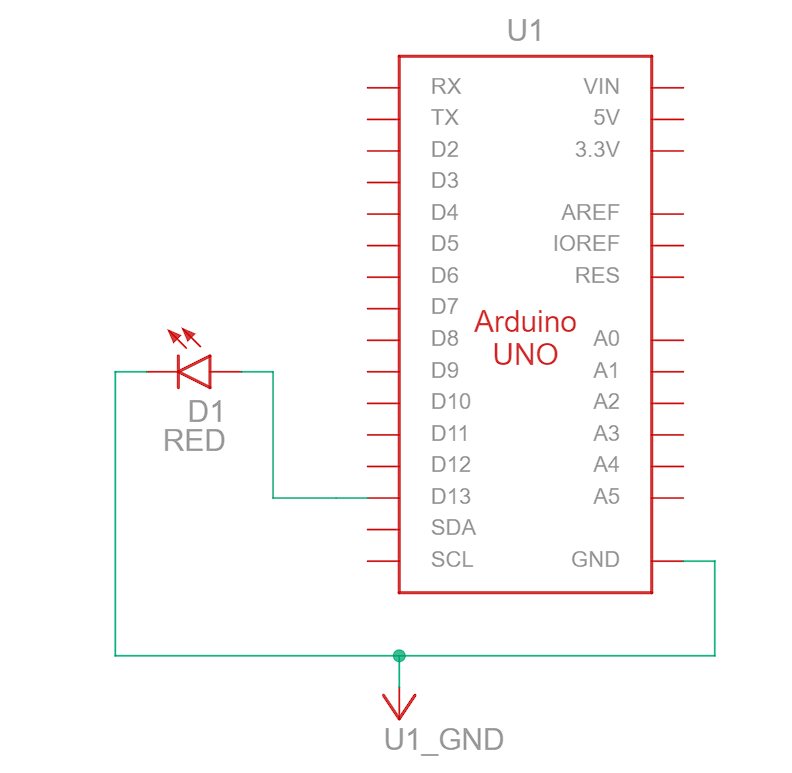
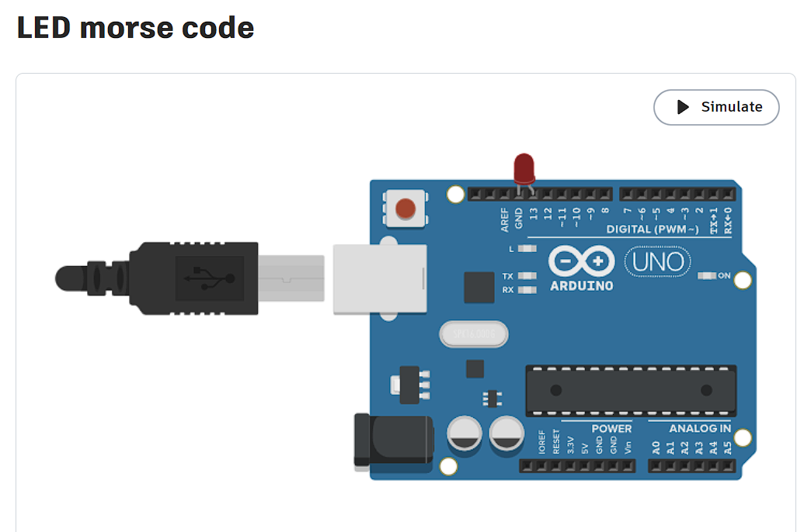

# Morse code converter

This is a simple Morse code converter that can convert text to Morse code and vice versa.

## Components
- Arduino Uno
- LED
- Usb type A to B cable for interfacing computer to Arduino

## Connections
| Srno | Src Component | Dest Component | Description |
| --- | --- |
| 1 | Arduino | LED | Pin 13 and GND to +ve and -ve connections respectively |

## How to use
1. Clone the repository
2. Open the `morse.ino` file in Arduino IDE
3. Connect the Arduino to the computer
4. Upload the code to the Arduino
5. Open the serial monitor
6. Type the text you want to convert to Morse code and press enter
7. The Morse code will be displayed on the serial monitor

## Diagrams
- Circuit diagram

- Reference image

## Link to the tinkercad demo
[Click here to view the demo](https://www.tinkercad.com/things/9lMny52Fx4W-led-morse-code)