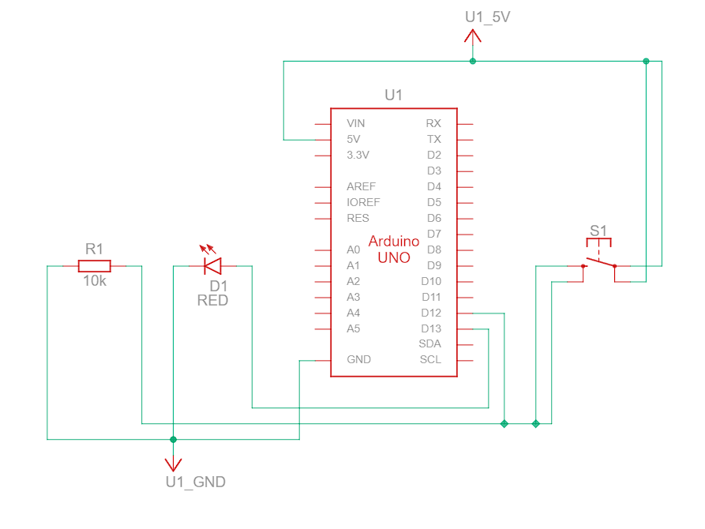
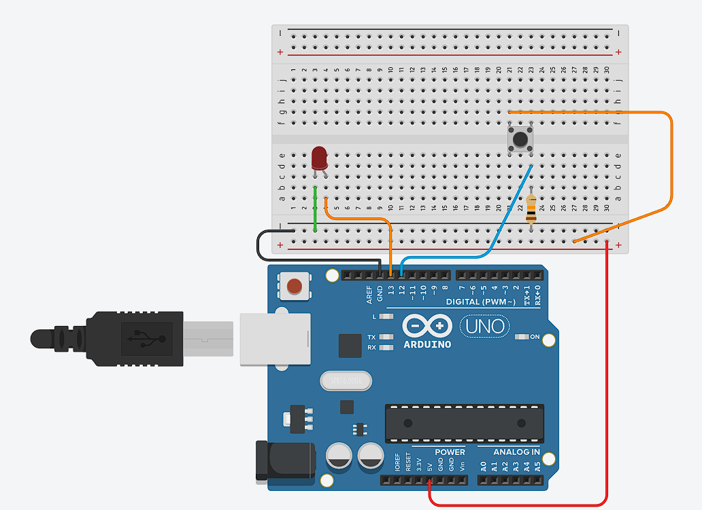

# Push buttons

This folder contains the code and circuit diagram for interfacing a push button with an Arduino Uno.

## Components
- Arduino Uno
- LED
- Usb type A to B cable for interfacing computer to Arduino
- 10k ohm resistor

## How to use
1. Clone the repository
2. Open the `single-button.ino` file in Arduino IDE
3. Connect the Arduino to the computer
4. Upload the code to the Arduino
5. Connect the push button to the Arduino as shown in the circuit diagram
6. Press the push button to turn the LED on and off

## Diagrams
- Circuit diagram

- Reference image

## Link to the tinkercad demo
[Click here to view the demo](https://www.tinkercad.com/things/jnvAr1ZuwJy-push-button-basic)